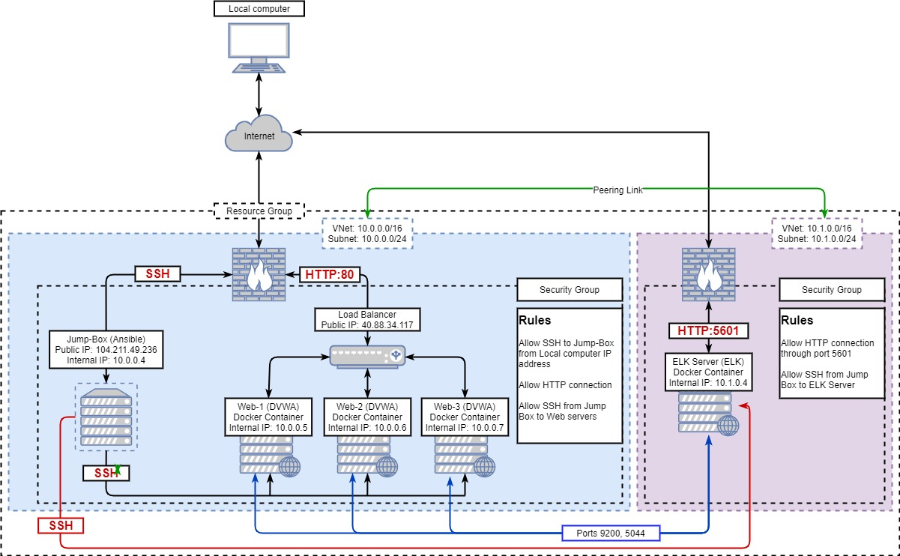
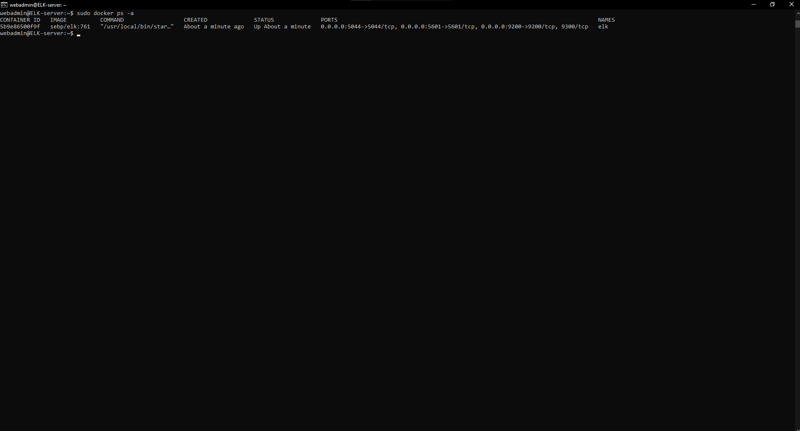
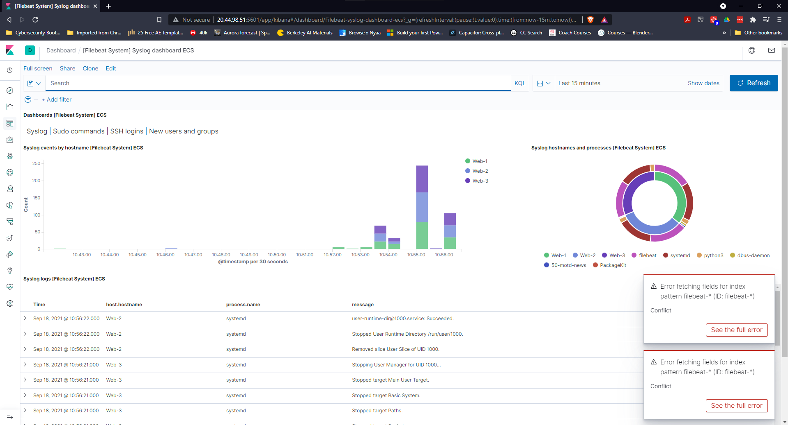
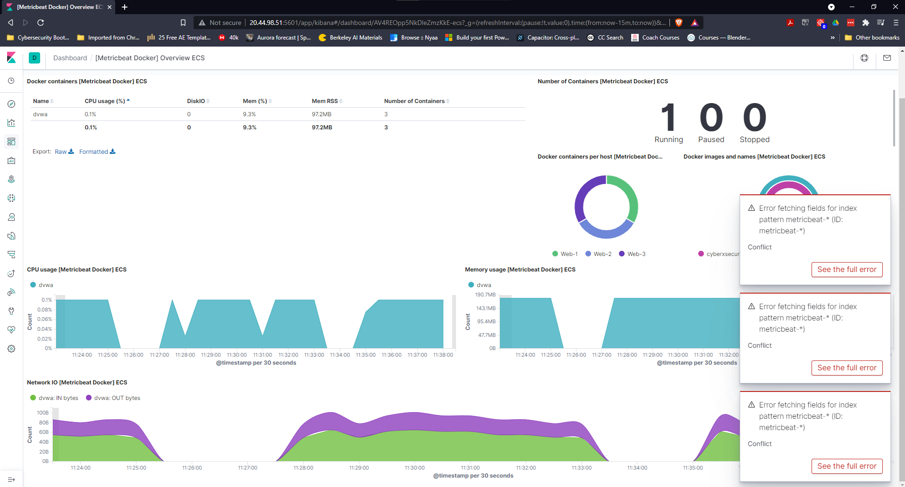

## Automated ELK Stack Deployment

The files in this repository were used to configure the network depicted below.

These files have been tested and used to generate a live ELK deployment on Azure. They can be used to either recreate the entire deployment pictured above. Alternatively, select portions of the [network_configuration.yml](Ansible/network_configuration.yml) file may be used to install only certain pieces of it, such as Filebeat.

This document contains the following details:
- Description of the Topology
- Access Policies
- ELK Configuration
  - Beats in Use
  - Machines Being Monitored
- How to Use the Ansible Build

### Description of the Topology

The main purpose of this network is to expose a load-balanced and monitored instance of DVWA, the D*mn Vulnerable Web Application.

Load balancing ensures that the application will be highly available, in addition to restricting access to the network.

Integrating an ELK server allows users to easily monitor the vulnerable VMs for changes to the apache logs and system CPU usage and services running in the Web Servers.

The configuration details of each machine may be found below.

| Name     | Function | IP Address | Operating System |
|----------|----------|------------|------------------|
| Jump Box | Gateway  | 10.0.0.4   | Linux            |
| Web-1    | Web Server | 10.0.0.5  | Linux           |
| Web-2    | Web Server | 10.0.0.6  | Linux           |
| Web-3    | Web Server | 10.0.0.7  | Linux           |
| ELK-Server | ELK Server | 10.1.0.4 | Linux           |

### Access Policies

The machines on the internal network are not exposed to the public Internet. 

Only the Jump Box machine can accept connections from the Internet. Access to this machine is only allowed from the following IP addresses:
- 65.94.89.103

Machines within the network can only be accessed by the Ansible container running in the Jump Box VM (10.0.0.4).

A summary of the access policies in place can be found in the table below.

| Name     | Publicly Accessible | Allowed IP Addresses |
|----------|---------------------|----------------------|
| Jump Box | Yes                 | 65.94.89.103         |
| Web-1    | No                  | 10.0.0.4 10.1.0.4    |
| Web-2    | No                  | 10.0.0.4 10.1.0.4    |
| Web-3    | No                  | 10.0.0.4 10.1.0.4    |
| ELK-Server | Yes               | 65.94.89.103 10.0.0.4 |

### Elk Configuration

Ansible was used to automate configuration of the ELK machine. No configuration was performed manually, which is advantageous because in the case of existing multiple machines running the same ELK configuration, ansible allows us to automatically deploy identical configuration to any number of machines by using IaC text files.

The playbook implements the following tasks:
- Update the `apt` library and install docker.io
- Install the python package installer known as `pip`
- Install the docker package using `pip`
- Increase the virtual memory to `262144` and ensure it does so automatically upon restarting the machine
- Download and launch the docker ELK container, expose the necessary ports for the container to receive the data from the Web servers, ensure the docker container runs after any reboot of the system and finally, enable the service.

The following screenshot displays the result of running `docker ps` after successfully configuring the ELK instance.

### Target Machines & Beats
This ELK server is configured to monitor the following machines:
- Web-1 `[10.0.0.5]`
- Web-2 `[10.0.0.6]`
- Web-3 `[10.0.0.7]`

We have installed the following Beats on these machines:
- Filebeat
- Metricbeat

These Beats allow us to collect the following information from each machine:
- `Filebeat` collects Apache logs to help analyze the requests made to the web servers (as seen in the image below)

- `Metricbeat` collects metrics in relation to CPU usage, memory, file system and overall system performance, as well as services running in the web servers (as seen in the image below)

### Using the Playbook
In order to use the playbook, you will need to have an Ansible control node already configured. Assuming you have such a control node provisioned: 

SSH into the control node and follow the steps below:
- Copy the _____ file to _____.
- Update the _____ file to include...
- Run the playbook, and navigate to ____ to check that the installation worked as expected.

_TODO: Answer the following questions to fill in the blanks:_
- _Which file is the playbook? Where do you copy it?_
- _Which file do you update to make Ansible run the playbook on a specific machine? How do I specify which machine to install the ELK server on versus which to install Filebeat on?_
- _Which URL do you navigate to in order to check that the ELK server is running?

_As a **Bonus**, provide the specific commands the user will need to run to download the playbook, update the files, etc._